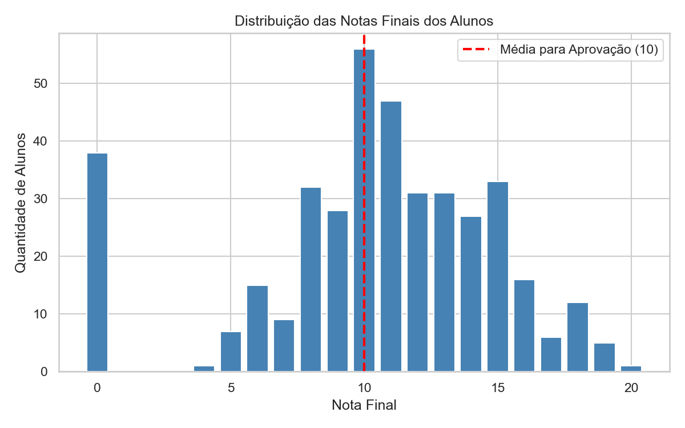
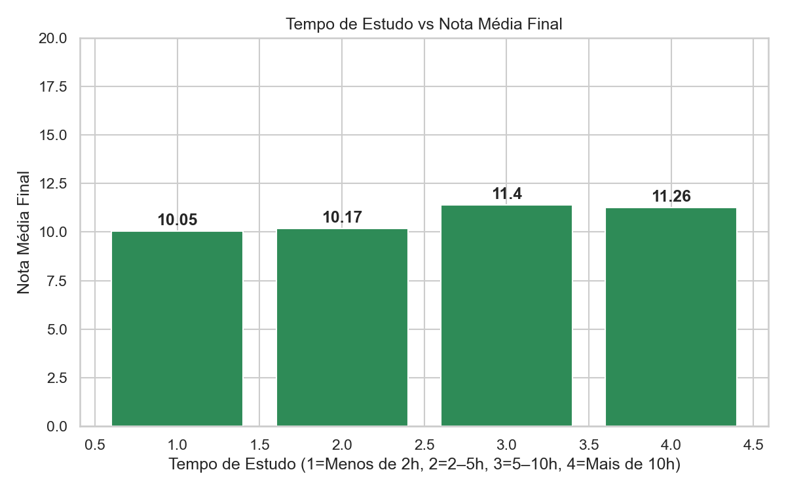
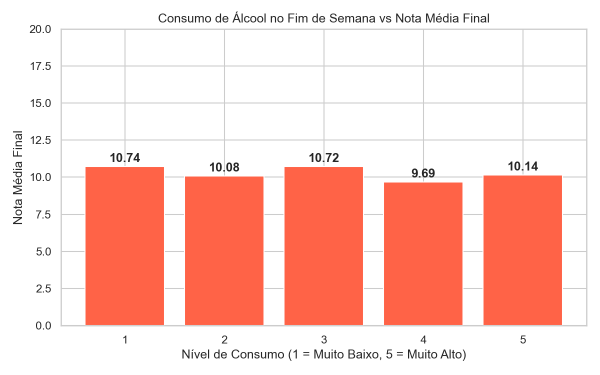

# Desempenho Escolar 

Análise exploratória dos dados coletados de duas escolas secundárias de Portugal durante o ano letivo de 2005–2006.

**Fonte:** [Kaggle — Student Alcohol Consumption](https://www.kaggle.com/datasets/uciml/student-alcohol-consumption/data)  
**Arquivo:** `student-mat.csv` (disciplina de Matemática)  
**Tamanho:** 395 alunos × 33 colunas

---

## Dataset

Os dados combinam informações escolares (notas, faltas, reprovações) com contexto familiar e comportamental (consumo de álcool, tempo de estudo, uso de internet). O objetivo é entender quais fatores influenciam o **desempenho acadêmico** dos alunos.

### Colunas disponíveis

| Coluna | Descrição |
|--------|-----------|
| `id_aluno` | Identificador do aluno |
| `escola` | Escola do aluno: GP ou MS |
| `sexo` | F = Feminino, M = Masculino |
| `idade` | Idade do aluno (15–22 anos) |
| `tipo_residencia` | U = urbano, R = rural |
| `tamanho_familia` | GT3 = mais de 3 membros, LE3 = até 3 membros |
| `situacao_pais` | T = juntos, A = separados |
| `educacao_mae` | Escolaridade da mãe: 0 = nenhuma … 4 = superior |
| `educacao_pai` | Escolaridade do pai: 0 = nenhuma … 4 = superior |
| `trabalho_mae` | Profissão da mãe |
| `trabalho_pai` | Profissão do pai |
| `motivo_escola` | Motivo da escolha da escola |
| `responsavel` | Responsável legal: mãe, pai ou outro |
| `tempo_viagem` | Tempo de deslocamento até a escola: 1 = <15min … 4 = >1h |
| `tempo_estudo` | Horas de estudo por semana: 1 = <2h, 2 = 2–5h, 3 = 5–10h, 4 = >10h |
| `reprovacoes_anteriores` | Número de reprovações anteriores (0–4) |
| `apoio_escola` | Suporte educacional pela escola (yes/no) |
| `apoio_familia` | Suporte educacional pela família (yes/no) |
| `aulas_pagas` | Aulas particulares pagas (yes/no) |
| `atividades_extracurriculares` | Participa de atividades extracurriculares (yes/no) |
| `frequentou_creche` | Frequentou creche ou pré-escola (yes/no) |
| `deseja_ensino_superior` | Pretende cursar ensino superior (yes/no) |
| `acesso_internet` | Possui internet em casa (yes/no) |
| `relacionamento_romantico` | Está em um relacionamento amoroso (yes/no) |
| `qualidade_relacoes_familiares` | Qualidade do relacionamento familiar: 1 = muito ruim … 5 = excelente |
| `tempo_livre` | Tempo livre após a escola: 1 = muito pouco … 5 = muito |
| `sair_com_amigos` | Frequência de saídas com amigos: 1 = muito pouco … 5 = muito |
| `consumo_alcool_semana` | Consumo de álcool nos dias úteis: 1 = muito baixo … 5 = muito alto |
| `consumo_alcool_fds` | Consumo de álcool nos fins de semana: 1 = muito baixo … 5 = muito alto |
| `saude` | Estado de saúde: 1 = muito ruim … 5 = muito bom |
| `faltas` | Número de faltas no ano (0–93) |
| `nota_periodo_1` | Nota do 1º período (0–20) |
| `nota_periodo_2` | Nota do 2º período (0–20) |
| `nota_final` | **Nota final (0–20)** — variável principal |

---

## Resultados da Análise Exploratória

### Distribuição das Notas Finais



A maioria dos alunos fica próxima da nota de aprovação (10). O pico em 0 representa alunos que provavelmente desistiram ou não compareceram ao exame final.

Obs.: Em Portugal, é utilizado uma escala numérica de 0 a 20 valores, sendo 10 a nota mínima para aprovação.

---

### Tempo de Estudo vs Nota Média



Quem dedica mais horas de estudo por semana tende a tirar notas médias maiores. A diferença entre estudar menos de 2h e mais de 5h já é bastante perceptível.

---

### Consumo de Álcool no Fim de Semana vs Nota Média



Alunos com menor consumo de álcool nos fins de semana (nível 1) apresentam as notas médias mais altas. Conforme o consumo aumenta, a nota média tende a cair.

---

## Estrutura do Projeto

```
pbl_4/
├── README.md
├── analise_exploratoria.ipynb   ← análise principal
├── data/
│   ├── student-mat.csv          ← dados originais
│   └── student-mat-limpo.csv    ← dados limpos (colunas em português)
└── graficos/                    ← gráficos gerados
```

---
